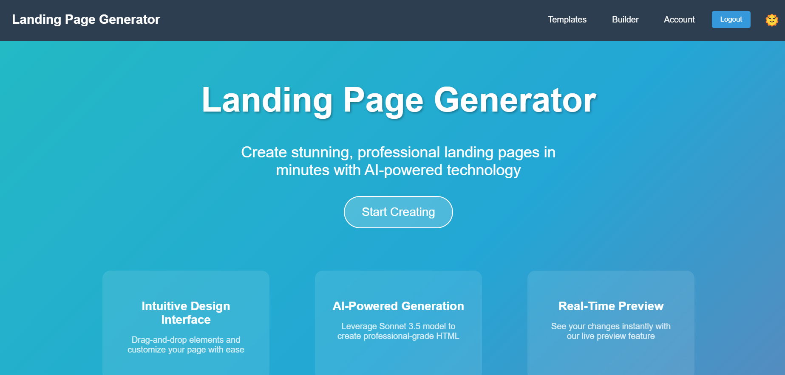

# Landing Page Generator



## Overview

This project is a Landing Page Generator that allows users to create custom landing pages by
selecting design types, colors, hero image URLs, and other imagery. Users can also provide a brief
product description. The generator uses the Sonnet 3.5 model to create a landing page and allow
download. Users can iteratively improve the generated page with additional instructions until they
are satisfied.

## Features

-   User-friendly interface for selecting design elements
-   Multiple design types to choose from
-   Custom color selection with ColorPicker component
-   Option to add hero images and other imagery using ImageUploader
-   Brief product description input
-   AI-powered HTML generation using Sonnet 3.5 model
-   Real-time preview in an iframe
-   Download option for the generated HTML file
-   Iterative improvement process with user feedback
-   Authentication system for user accounts
-   Persistent storage of user-generated websites
-   Template selection for quick start designs
-   User account management

## Technical Considerations

-   Ensure cross-browser compatibility
-   Implement a backend API for more advanced features
-   Consider serverless architecture for scalability
-   Ensure secure authentication and data protection
-   Implement proper error handling and logging
-   Use context API for state management
-   Implement responsive design for mobile compatibility
-   Optimize API calls to reduce latency
-   Use lazy loading for improved performance
-   Implement progressive web app (PWA) features
-   Model: 'claude-3-5-sonnet-20240620'

## Project Structure

-   `src/`: Contains the main React application code
    -   `components/`: Reusable UI components
    -   `contexts/`: React context providers for state management
    -   `pages/`: Individual page components
    -   `services/`: API and external service integrations
-   `server/`: Backend server implementation
-   `public/`: Static assets and entry HTML file

## Getting Started

1. Clone the repository
2. Install dependencies for both client and server:
    ```
    npm install
    cd server && npm install
    ```
3. Set up environment variables in /server/.env
    - CLAUDE_KEY
    - MONGODB_URI
    - JWT_SECRET
4. Run the development server:
    ```
    npm run dev
    ```
5. Access the application through your web browser at `http://localhost:3000`

## Future Enhancements

-   Add support for custom CSS input
-   Integrate with popular CMS platforms
-   Implement A/B testing capabilities for landing pages
-   Add analytics integration for performance tracking
-   Develop a template marketplace for user-created designs
-   Implement multi-language support for generated pages
-   Add SEO optimization tools for generated pages
-   Implement social media integration for sharing and promotion
-   Add email marketing integration for lead capture
-   Implement version control for user-generated pages
-   Add support for custom domains and hosting

## Design Ideas

-   Implement a dark mode toggle for improved user experience
-   Add a guided tour for new users to showcase features
-   Implement a live chat support system for user assistance
-   Create a dashboard for users to manage multiple landing pages
-   Add a feedback system for users to rate and review templates
-   Implement a notification system for updates and new features
-   Create a blog section for landing page design tips and tricks
-   Add a community forum for users to share ideas and get help
-   Implement a recommendation system for design elements based on user preferences
-   Add a drag-and-drop interface for easier layout customization
-   Implement a color scheme generator based on uploaded images
-   Create a mobile app version for on-the-go editing
-   Add integration with popular design tools (e.g., Figma, Sketch)
-   Implement AI-powered content suggestions for landing page copy
-   Add a feature for exporting designs to popular e-commerce platforms
-   Implement a collaborative editing feature for team projects
-   Create a design history feature to track and revert changes
-   Add support for custom fonts and typography options
-   Implement a performance optimization tool for generated pages

## DevOps and Deployment

-   Set up continuous integration and deployment (CI/CD) pipeline
-   Implement Docker containerization for easy deployment and scaling
-   Configure automated testing for both frontend and backend
-   Set up monitoring and logging for production environment
-   Implement database backups and disaster recovery plans
-   Configure load balancing for high availability
-   Implement caching strategies for improved performance
-   Set up staging environments for testing before production deployment
-   Implement infrastructure as code (IaC) for reproducible deployments

## Security Considerations

-   Implement HTTPS for secure communication
-   Set up rate limiting to prevent abuse
-   Implement input validation and sanitization
-   Use secure session management
-   Regularly update dependencies to patch security vulnerabilities
-   Implement CSRF protection
-   Set up security headers (e.g., Content Security Policy)
-   Perform regular security audits and penetration testing

## Contributing

Contributions are welcome! Please read our contributing guidelines and code of conduct before
submitting pull requests.

## License

This project is licensed under the MIT License.

# TODO

-   migrate all UI to MUI, including dark switch

